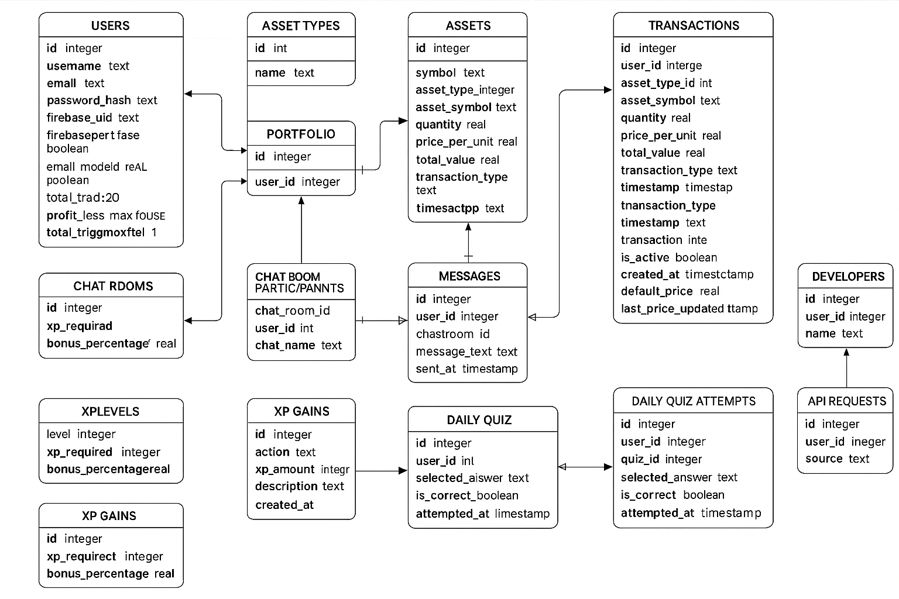

# BuyHigh.io – Feature Overview & Codebase Documentation

## Overview

BuyHigh.io is a gamified stock trading platform designed for learning and entertainment. It combines trading mechanics with playful elements like XP, badges, and a mood pet to engage users. The app is built using Flask, with a modular codebase that supports extensibility and integration with external services like Firebase.

---

## Features

### Core Features
- **User Authentication**: Register, login, and manage accounts with secure password hashing.
- **Portfolio Management**: Track your assets, view performance, and calculate gains/losses.
- **Stock Trading**: Buy and sell stocks with real-time or demo data.
- **Dashboard**: Overview of account balance, portfolio, recent transactions, and achievements.
- **Gamification**: Earn XP, unlock badges, and level up as you trade.
- **Mood Pet**: A virtual companion reflecting your trading success.
- **Meme Mode**: Activate fun, meme-inspired features for a lighthearted experience.

### Advanced Features
- **Chat System**: Real-time messaging with Firebase integration and SQLite fallback.
- **Interactive Charts**: Candlestick charts with multiple timeframes and live updates.
- **API Endpoints**: RESTful APIs for stock data, trading, and portfolio management.
- **Management CLI**: Tools for database setup, Firebase migration, and status checks.

### Planned Features
- **Stripe Integration**: Add real money to purchase virtual currency.
- **Passkey Login**: Secure authentication using passkeys.
- **Electron Support**: Desktop application for enhanced usability.
- **Multilingual Support**: Localization for a global audience.

---

## Codebase Overview

### Backend
- **`app.py`**: Main Flask application setup, including routing, session handling, and error management.
- **`routes/`**: Modular route definitions for main pages, authentication, API, and chat.
- **`database/handler/`**: Database interaction modules for PostgreSQL and Firebase.
- **`auth.py`**: Firebase authentication and user management.
- **`manage.py`**: CLI for database and Firebase operations.

### Frontend
- **Templates (`/templates/`)**: Jinja2 templates for rendering HTML pages.
- **Static Files (`/static/`)**: JavaScript and CSS for interactivity and styling.

### Key Modules
- **`transactions_handler.py`**: Handles trading logic, portfolio updates, and profit/loss calculations.
- **`stock_data.py`**: Fetches stock data from APIs or generates demo data.
- **`utils.py`**: Utility functions like login decorators.

---

## Database Structure

### Tables Overview
- **Users**: Stores user details, balance, XP, preferences, and more.
- **Assets**: Information about tradable stocks, crypto, etc., including metadata like sector and industry.
- **Transactions**: Records of buy/sell actions with calculated total values.
- **Portfolio**: Tracks user holdings, average buy prices, and total investments.
- **Chat Rooms**: Manages chat rooms, participants, and messages.
- **XP Levels**: Defines XP requirements and bonuses for leveling up.
- **XP Gains**: Configures XP rewards for specific user actions.
- **Daily Quiz**: Stores quiz questions and tracks user attempts.
- **Developers**: Identifies developers with special privileges.
- **API Requests**: Logs API usage by users.

### Key Relationships
- **Users ↔ Transactions**: Tracks which user performed a transaction.
- **Users ↔ Portfolio**: Links users to their asset holdings.
- **Users ↔ Chat Rooms**: Manages user participation in chat rooms.
- **Users ↔ XP Gains**: Awards XP for specific actions.
- **Users ↔ Daily Quiz**: Tracks quiz attempts and correctness.

Refer to the diagram above for a visual representation of the database schema.

---

## Management Commands

- **`setup`**: Initialize the database schema.
- **`status`**: Check Firebase connection status.
- **`migrate`**: Migrate chat data from SQLite to Firebase.
- **`reset-firebase-chat`**: Reset Firebase chat data.

---

## Notes

- Prices are stored in USD, while account balances are in EUR.
- Demo data is used when API data is unavailable.
- The app is for educational purposes and not for real trading.
