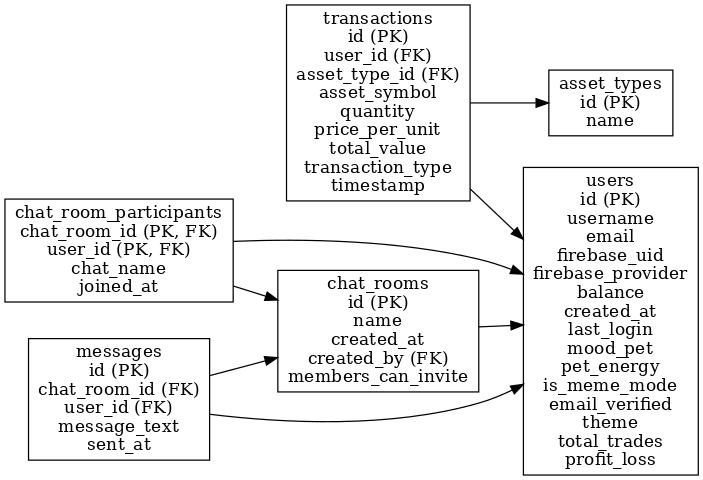

# Database Documentation

This document provides an overview of the database schema for the `BuyHigh.io` application. The schema is defined in the file [`postgres_schema.sql`](./postgres_schema.sql).

## Entity-Relationship Diagram (ERD)

Below is the Entity-Relationship Diagram (ERD) for the database:

## Tables Overview

### 1. `users`
Stores information about the users of the application.

- **Primary Key**: `id`
- **Columns**:
    - `username`: Unique username for the user.
    - `email`: Unique email address.
    - `balance`: User's account balance (default: 10000.0).
    - `mood_pet`: Virtual pet associated with the user (default: "bull").
    - `is_meme_mode`: Boolean flag for meme mode (default: `false`).
    - Other metadata like `created_at`, `last_login`, etc.

---

### 2. `asset_types`
Defines the types of assets available (e.g., stocks, crypto).

- **Primary Key**: `id`
- **Columns**:
    - `name`: Name of the asset type (e.g., "stock").

---

### 3. `transactions`
Tracks all buy/sell transactions made by users.

- **Primary Key**: `id`
- **Columns**:
    - `user_id`: Foreign key referencing `users`.
    - `asset_type_id`: Foreign key referencing `asset_types`.
    - `asset_symbol`: Symbol of the asset (e.g., "AAPL").
    - `transaction_type`: Either "buy" or "sell".
    - `total_value`: Auto-calculated as `quantity * price_per_unit`.

---

### 4. `chat_rooms`
Manages chat rooms for user interactions.

- **Primary Key**: `id`
- **Columns**:
    - `name`: Unique name of the chat room.
    - `created_by`: Foreign key referencing `users`.

---

### 5. `chat_room_participants`
Tracks participants in chat rooms.

- **Primary Key**: Composite key (`chat_room_id`, `user_id`).
- **Columns**:
    - `chat_room_id`: Foreign key referencing `chat_rooms`.
    - `user_id`: Foreign key referencing `users`.

---

### 6. `messages`
Stores messages sent in chat rooms.

- **Primary Key**: `id`
- **Columns**:
    - `chat_room_id`: Foreign key referencing `chat_rooms`.
    - `user_id`: Foreign key referencing `users`.
    - `message_text`: Content of the message.

---

### 7. `assets`
Defines individual assets available for trading.

- **Primary Key**: `id`
- **Columns**:
    - `symbol`: Unique symbol for the asset (e.g., "AAPL").
    - `name`: Full name of the asset.
    - `asset_type`: Type of the asset (e.g., "stock").
    - Additional metadata like `exchange`, `sector`, etc.

---

### 8. `portfolio`
Tracks the assets owned by users.

- **Primary Key**: `id`
- **Columns**:
    - `user_id`: Foreign key referencing `users`.
    - `asset_id`: Foreign key referencing `assets`.
    - `quantity`: Total amount of the asset held by the user.
    - `average_buy_price`: Average cost per unit.

---

## Sample Data

### Predefined Chat Room
- `General`: A default chat room created during initialization.

### Predefined Assets
- `AAPL`: Apple Inc. (Stock)
- `TSLA`: Tesla Inc. (Stock)
- `BTC`: Bitcoin (Crypto)
- `ETH`: Ethereum (Crypto)

---

For more details, refer to the [PostgreSQL schema file](./postgres_schema.sql).  
